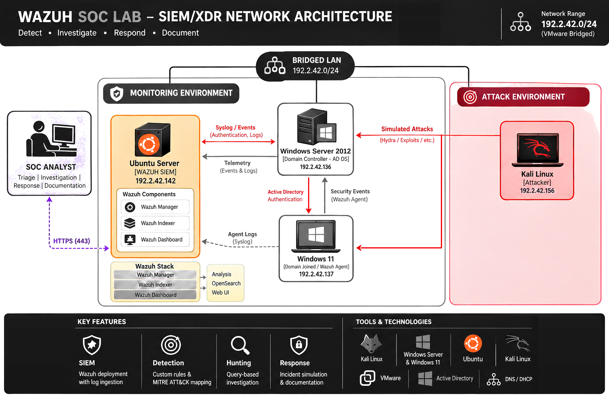

<div align="center">

# Hi, I'm Mojaki Tjeeka

### Computing graduate · IT Infrastructure · Information Security · Data & ML

*I build labs, break things on purpose, analyse what happened, document it all, and learn from it.*

-Computing-0d1117?style=for-the-badge&logo=academia&logoColor=white)


</div>

---

##  About Me
I'm a BSc (Hons) Computing graduate with a background in Networking & Infrastructure Management, interested in building, supporting and securing IT environments.

My work focuses primarily on IT infrastructure and cybersecurity, with practical experience through hands-on labs involving Windows Server, Active Directory, VMware, Linux and Wazuh.

I learn by building realistic environments, testing them, troubleshooting failures and documenting the results.

-  Every project is a hands-on lab with configs, screenshots, and a formal write-up
-  Blue team focus — I've gone deep on SIEM detection engineering, proactive threat hunting, and the full SOC analyst workflow from triage to post-incident report
-  Open to **junior roles** in IT, security, data or software

---

##  What I Can Do

|  Cybersecurity |  Infrastructure |  Dev & Automation |  Data & ML |
|---|---|---|---|
| SIEM deployment & tuning | VMware lab environments | Python · PowerShell · Bash | Data cleaning & EDA |
| Windows event log analysis | Windows Server & AD DS | Git & GitHub workflows | Pandas · Matplotlib |
| Custom detection rule writing | DNS · DHCP · Group Policy | REST API integration | scikit-learn experiments |
| Threat hunting & IOC pivoting | Linux server administration | Scripting & automation | Jupyter notebooks |
| MITRE ATT&CK mapping | Network troubleshooting | Web apps (PHP · JS · Node) | Data visualisation |
| Incident response (NIST 800-61) | Virtualisation & snapshots | SQL & database management | Model evaluation |

---

##  What I Work On

| | Area | What it covers |
|:-:|---|---|
|  | **Security & Blue Team** | SIEM, detection engineering, threat hunting, incident response |
|  | **Virtualization & Active Directory** | Lab design, domain services, networking, system administration |
|  | **Data Analytics** | Cleaning, analysis, visualisation, dashboards |
|  | **Machine Learning** | Models, evaluation, applied experiments |
|  | **Programming** | Scripts, tools, automation, small applications |

---

##  Featured Project: SOC Analyst Home Lab

> A defender-side SOC lab. Attacks run from Kali and are detected, hunted and responded to from the SIEM, with **no agent on the attacker machine**, mirroring real SOC visibility constraints.

[](https://github.com/cyprianus-m-t/soc-analyst-homelab)

###  Lab network architecture

<p align="center">
  
</p>

| | Project | Outcome | Skills |
|:-:|---|---|---|
| **01** | [SIEM Setup & Log Ingestion](https://github.com/cyprianus-m-t/soc-analyst-homelab/blob/main/project-1-siem-setup) | Deployed Wazuh, validated the end-to-end log pipeline, tuned audit policy | `SIEM` `Audit policy` |
| **02** | [Brute Force Detection](https://github.com/cyprianus-m-t/soc-analyst-homelab/blob/main/project-2-brute-force) | Simulated SMB/RDP attacks with Hydra; wrote custom frequency-correlation rules | `Custom rules` `MITRE ATT&CK` |
| **03** | [Active Directory Attack Detection](https://github.com/cyprianus-m-t/soc-analyst-homelab/blob/main/project-3-ad-attacks) | Detected rogue account creation, DA escalation, and log clearing via Windows event analysis | `AD security` `Log analysis` |
| **04** | [Threat Hunting](https://github.com/cyprianus-m-t/soc-analyst-homelab/blob/main/project-4-threat-hunting) | Reconstructed a 3-event attack chain from fragmented SIEM logs; wrote a P1 case note for Tier 2 escalation | `Hunting` `IOC pivoting` `Case documentation` |
| **05** | [Incident Response Simulation](https://github.com/cyprianus-m-t/soc-analyst-homelab/blob/main/project-5-incident-response) | Ran the full IR lifecycle — containment, eradication, recovery — and wrote the post-incident report | `NIST 800-61` `AD remediation` |

*"The attacker cleared the local Security log three times. Wazuh had already forwarded everything."*

---

##  Project Roadmap

Projects in progress or planned. I'll link each one here as it ships.

| Status | Area | Project |
|:-:|---|---|
|  |  Security | [SOC Analyst Home Lab](https://github.com/cyprianus-m-t/soc-analyst-homelab) |
|  |  Infrastructure | Virtualization lab: hypervisor setup, networking, VM templates |
|  |  Infrastructure | Active Directory lab: domain build, users and groups, GPO, DNS/DHCP |
|  |  Data | Data analytics project: dataset → cleaning → insights → dashboard |
|  |  ML | Machine learning project: problem → model → evaluation → write-up |
|  |  Programming | Programming projects: automation scripts and small tools |

<sub> Done ·  In progress ·  Planned</sub>

---

##  How I Work

```
  Plan  ─▶  Build  ─▶  Test / Break  ─▶  Analyse  ─▶  Document  ─▶  Improve
```

Every repo aims to include a clear README, setup steps, screenshots or outputs, and what I learned.

---

##  Toolkit

 **Security**


 **Infrastructure**


 **Data** &  **ML**


 **Programming**


---

##  Let's Connect

[](mailto:mojakitjeeka@gmail.com)
[](https://github.com/cyprianus-m-t)
[](https://www.linkedin.com/in/YOUR-LINKEDIN-HANDLE)

<div align="center">

<sub> All attack simulations run in an isolated lab environment.</sub>

</div>
